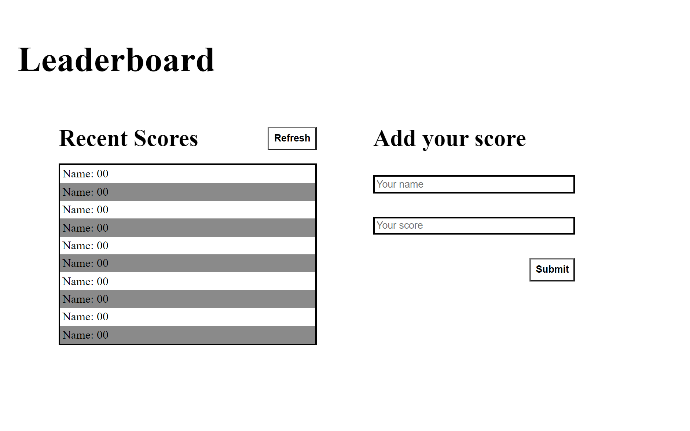

<h1>Leaderboard</h1>

 
  
   

<!-- TABLE OF CONTENTS -->

# 📗 Table of Contents

- [📖 About the Project](#about-project)
  - [🛠 Built With](#built-with)
    - [Tech Stack](#tech-stack)
    - [Key Features](#key-features)
  - [🚀 Live Demo](#live-demo)
- [💻 Getting Started](#getting-started)
  - [Setup](#setup)
  - [Prerequisites](#prerequisites)
  - [Install](#install)
  - [Usage](#usage)
  - [Run tests](#run-tests)
  - [Deployment](#deployment)
- [👥 Authors](#authors)
- [🔭 Future Features](#future-features)
- [🤝 Contributing](#contributing)
- [⭐️ Show your support](#support)
- [🙏 Acknowledgements](#acknowledgements)
- [❓ FAQ](#faq)
- [📝 License](#license)

<!-- PROJECT DESCRIPTION -->

# 📖 Leaderboard 

**Leaderboard list app**  is a JavaScript project, using webpack and ES6 features, notably modules, and consume the Leaderboard API using JavaScript async/await.

## 🛠 Built With 

### Tech Stack 

  
Client

  <ul>
    <li>html</li>
    <li>css</li>
    <li>js</li>
    <li>ES6</li>
    <li>webpack</li>
  </ul>

  
Server

  <ul>
    <li>Not aplies</a></li>
  </ul>

Database

  <ul>
    <li>Not aplies</a></li>
  </ul>

<!-- Features -->

### Key Features 

- **Single page application.**
- **Use ES6 syntax.**

(<a href="#readme-top">back to top</a>)

<!-- LIVE DEMO -->

## 🚀 Live Demo 

- applicable in future features (https://github.com/Abdelaziz-Ali/Leaderboard)

(<a href="#readme-top">back to top</a>)

<!-- GETTING STARTED -->

## 💻 Getting Started 

To get a local copy up and running, follow these steps.

### Prerequisites

In order to run this project you need:

- Install Node.js.
- Visual Studio Code or equivalent. 
- Internet Browser

### Setup

Clone this repository to your desired folder:

- cd my-folder
- git clone [https://github.com/Abdelaziz-Ali/Webpack-Template.git](https://github.com/Abdelaziz-Ali/Webpack-Template.git)

### Install

Install this project with:

- cd my-project
- git config --global --add safe.directory my-directory/my-folder/my-project
 
### Usage

To run the project, execute the following command:

- code .
- git status
- npm init
- npm install
- npm i webpack
- npm start

### Run tests

To run tests, run the following command:

applicable in future features

### Deployment

You can deploy this project using:

Github Pages

(<a href="#readme-top">back to top</a>)

<!-- AUTHORS -->

## 👥 Authors 

👤 Abdelaziz Ali

- GitHub: [@Abdelaziz-Ali](https://github.com/Abdelaziz-Ali)
- Twitter: [@AbdelazizDV](https://twitter.com/AbdelazizDV)
- LinkedIn: [in/abdelaziz-ali-dev](https://www.linkedin.com/in/abdelaziz-mahdi)

(<a href="#readme-top">back to top</a>)

<!-- FUTURE FEATURES -->

## 🔭 Future Features 

- [ ] **Send and receive data from API.**
- [ ] **Style final touches.**

(<a href="#readme-top">back to top</a>)

## 🤝 Contributing 

Contributions, issues, and feature requests are welcome!

(<a href="#readme-top">back to top</a>)

## ⭐️ Show your support 

Give a ⭐️ if you like this project!

(<a href="#readme-top">back to top</a>)

## 🙏 Acknowledgments 

Templete used in project provided by (Microverse)!

(<a href="#readme-top">back to top</a>)

## 📝 License 

This project is [MIT](./LICENSE) licensed.

(<a href="#readme-top">back to top</a>)

